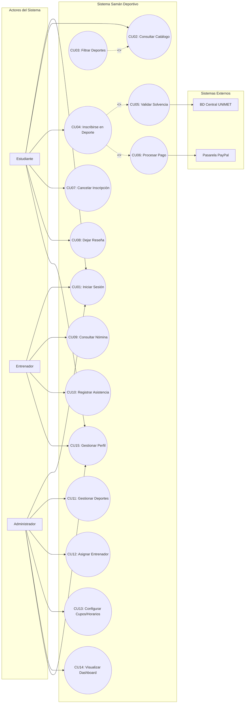
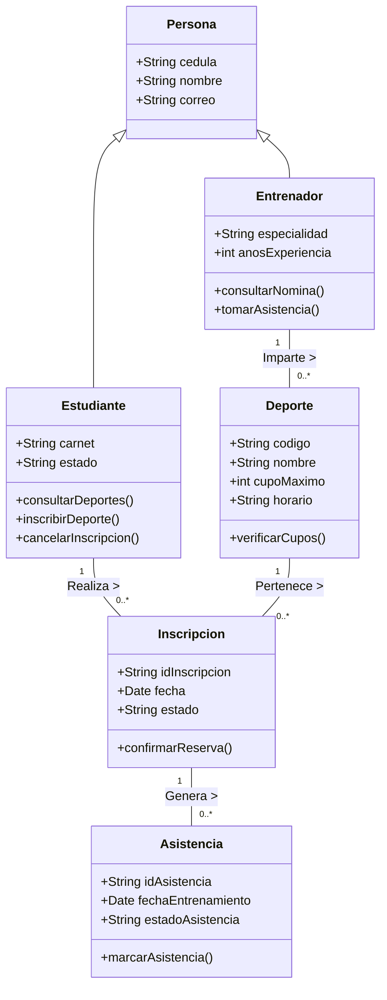
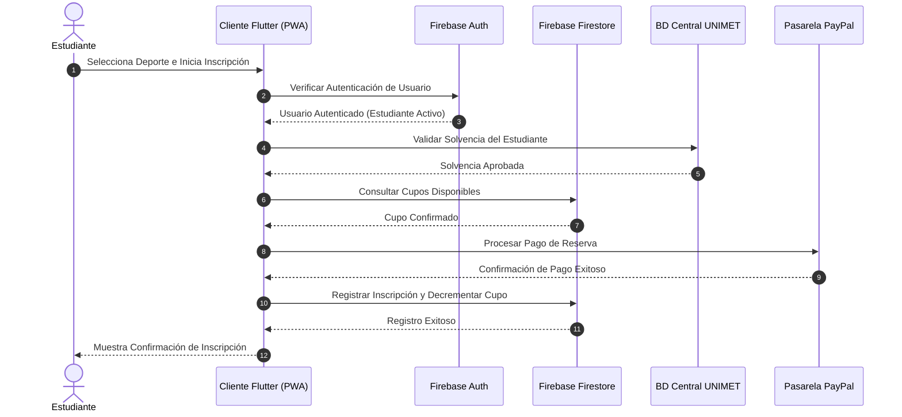

# Proyecto-Sistemas-de-Info

## 1. Diagrama de Casos de Uso

```mermaid
flowchart LR
    subgraph Actores ["Actores del Sistema"]
        E["Estudiante"]
        EN["Entrenador"]
        A["Administrador"]
    end

    subgraph Saman_Deportivo ["Sistema Samán Deportivo"]
        CU01(("CU01: Iniciar Sesión"))
        CU02(("CU02: Consultar Catálogo"))
        CU03(("CU03: Filtrar Deportes"))
        CU04(("CU04: Inscribirse en Deporte"))
        CU05(("CU05: Validar Solvencia"))
        CU06(("CU06: Procesar Pago"))
        CU07(("CU07: Cancelar Inscripción"))
        CU08(("CU08: Dejar Reseña"))
        CU09(("CU09: Consultar Nómina"))
        CU10(("CU10: Registrar Asistencia"))
        CU11(("CU11: Gestionar Deportes"))
        CU12(("CU12: Asignar Entrenador"))
        CU13(("CU13: Configurar Cupos/Horarios"))
        CU14(("CU14: Visualizar Dashboard"))
        CU15(("CU15: Gestionar Perfil"))
    end

    subgraph Sistemas_Externos ["Sistemas Externos"]
        UNI["BD Central UNIMET"]
        PAY["Pasarela PayPal"]
    end

    E --> CU01
    E --> CU02
    E --> CU04
    E --> CU07
    E --> CU08
    E --> CU15

    CU03 -.->|<<extend>>| CU02
    CU04 -.->|<<include>>| CU05
    CU04 -.->|<<include>>| CU06

    EN --> CU01
    EN --> CU09
    EN --> CU10
    EN --> CU15

    A --> CU01
    A --> CU11
    A --> CU12
    A --> CU13
    A --> CU14
    A --> CU15

    CU05 --> UNI
    CU06 --> PAY
```

## 2. Diagrama de Clases

```mermaid
classDiagram
    class Persona {
        +String cedula
        +String nombre
        +String correo
    }

    class Estudiante {
        +String carnet
        +String estado
        +consultarDeportes()
        +inscribirDeporte()
        +cancelarInscripcion()
    }

    class Entrenador {
        +String especialidad
        +int anosExperiencia
        +consultarNomina()
        +tomarAsistencia()
    }

    class Deporte {
        +String codigo
        +String nombre
        +int cupoMaximo
        +String horario
        +verificarCupos()
    }

    class Inscripcion {
        +String idInscripcion
        +Date fecha
        +String estado
        +confirmarReserva()
    }

    class Asistencia {
        +String idAsistencia
        +Date fechaEntrenamiento
        +String estadoAsistencia
        +marcarAsistencia()
    }

    Persona <|-- Estudiante
    Persona <|-- Entrenador

    Entrenador "1" -- "0..*" Deporte : Imparte >
    Estudiante "1" -- "0..*" Inscripcion : Realiza >
    Deporte "1" -- "0..*" Inscripcion : Pertenece >
    Inscripcion "1" -- "0..*" Asistencia : Genera >
```

## 3. Diagrama de Secuencia

```mermaid
sequenceDiagram
    autonumber
    actor Estudiante
    participant UI as Cliente Flutter (PWA)
    participant Auth as Firebase Auth
    participant DB as Firebase Firestore
    participant UNIMET as BD Central UNIMET
    participant Pago as Pasarela PayPal

    Estudiante->>UI: Selecciona Deporte e Inicia Inscripción
    UI->>Auth: Verificar Autenticación de Usuario
    Auth-->>UI: Usuario Autenticado (Estudiante Activo)

    UI->>UNIMET: Validar Solvencia del Estudiante
    UNIMET-->>UI: Solvencia Aprobada

    UI->>DB: Consultar Cupos Disponibles
    DB-->>UI: Cupo Confirmado

    UI->>Pago: Procesar Pago de Reserva
    Pago-->>UI: Confirmación de Pago Exitoso

    UI->>DB: Registrar Inscripción y Decrementar Cupo
    DB-->>UI: Registro Exitoso
    UI-->>Estudiante: Muestra Confirmación de Inscripción
```
